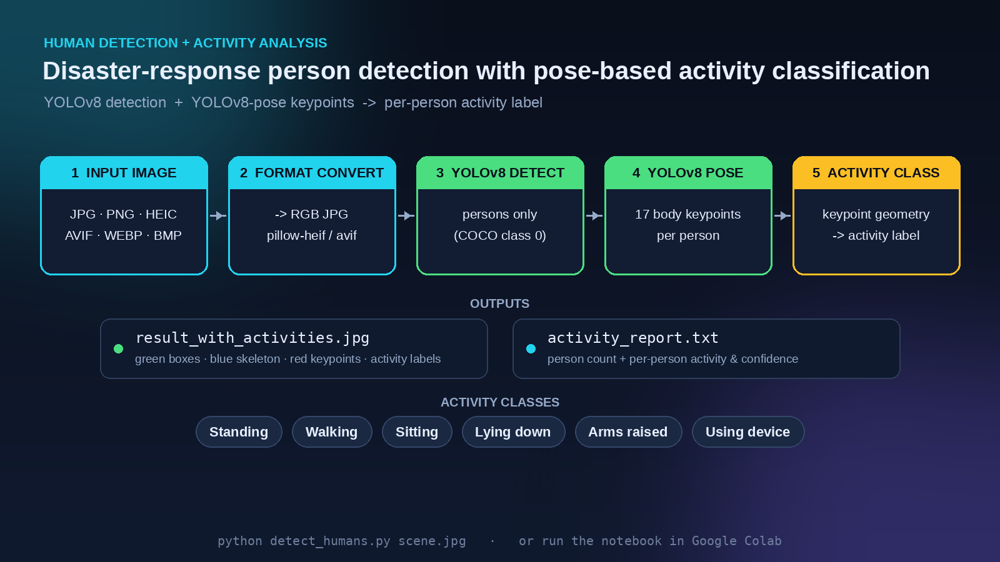

# Human Detection with Activity Analysis

<p align="center">
  
  
  
  
  
  
  
</p>

<p align="center">
  <a href="https://colab.research.google.com/github/Sohanngolla/Human-Detection-in-Natural-Disaster/blob/main/notebooks/human_detection_activity_analysis.ipynb">
    
  </a>
</p>

**Person detection and pose-based activity classification for natural-disaster and search-and-rescue imagery.**

Given a single photo of a scene, this project detects every person, estimates their body pose, and labels what each one appears to be doing — *standing, walking, sitting, lying down, arms raised,* or *using a device*. In a disaster-response context, that distinction matters: a person **lying down** or with **arms raised** reads very differently from someone **walking**, and a fast automated pass over incoming photos can help responders triage where to look first.

It runs on **YOLOv8** for detection and **YOLOv8-pose** for keypoints, and works out of the box on phone photos — including Apple **HEIC** and **AVIF** — by auto-converting them before inference.

<p align="center">
   format convert -> YOLOv8 detection -> YOLOv8 pose -> activity classification -> annotated image + report" width="100%">
</p>

---

## Features

- **Person detection** with YOLOv8 (`yolov8n.pt`), filtered to the COCO *person* class only.
- **Pose estimation** with YOLOv8-pose (`yolov8n-pose.pt`) — 17 body keypoints per person.
- **Activity classification** from keypoint geometry: `Standing`, `Walking`, `Sitting`, `Lying down`, `Arms raised`, `Using device` (falls back to `Person detected` when too few keypoints are visible).
- **Wide image-format support** — JPG, PNG, HEIC, AVIF, WEBP, BMP, TIFF are auto-converted to RGB JPG before inference.
- **Two clear outputs** — an annotated image (bounding boxes, pose skeleton, keypoints, activity labels) and a plain-text activity report with a per-person breakdown.
- Runs from the **command line** locally or as a **Google Colab** notebook (upload → analyze → download).

---

## How it works

1. **Input & convert** — the image is loaded; non-standard formats (HEIC/AVIF/WEBP/…) are converted to RGB JPG using `pillow-heif` / `pillow-avif-plugin`.
2. **Detect** — `yolov8n.pt` runs on the image; only detections of COCO class `0` (person) are kept.
3. **Pose** — `yolov8n-pose.pt` produces 17 keypoints (nose, shoulders, elbows, wrists, hips, knees, ankles, …) per person.
4. **Classify** — a rules-based function reads the keypoint geometry (e.g. shoulder-to-hip height for *lying down*, knee separation for *walking*, wrist-above-shoulder for *arms raised*) and assigns an activity.
5. **Render & report** — each person is drawn with a green box, blue skeleton, red keypoints, and an activity label; a text report summarizes the count and per-person activity + detection confidence.

---

## Quick start (local)

```bash
# 1. Install dependencies
pip install -r requirements.txt

# 2. Run on an image (model weights download automatically on first run)
python detect_humans.py path/to/scene.jpg

# Options
python detect_humans.py scene.heic --out results/ --conf 0.25
```

Outputs are written to the `--out` directory (default: `output/`):

```
output/
├── result_with_activities.jpg   # annotated image
└── activity_report.txt          # per-person breakdown
```

## Run in Google Colab

Open `notebooks/human_detection_activity_analysis.ipynb` in Colab and run all cells. It installs dependencies, prompts you to upload an image, runs detection + pose + activity analysis, displays the annotated result, and downloads the image and report. A lighter people-counter-only variant is in `notebooks/simple_people_counter.ipynb`.

---

## Example report

```
============================================================
HUMAN ACTIVITY DETECTION REPORT
============================================================

Source file: scene.jpg
Size: 1280x853
Total persons detected: 3

INDIVIDUAL ANALYSIS:
----------------------------------------
Person 1:
  Activity: Standing
  Detection Confidence: 91.24%

Person 2:
  Activity: Lying down
  Detection Confidence: 84.10%

Person 3:
  Activity: Arms raised
  Detection Confidence: 78.65%
```

---

## Project structure

```
human-detection-disaster/
├── detect_humans.py          # CLI script: detection + pose + activity + report
├── requirements.txt
├── assets/
│   └── pipeline.png          # architecture / workflow diagram
├── notebooks/
│   ├── human_detection_activity_analysis.ipynb   # full Colab version
│   └── simple_people_counter.ipynb               # lightweight counter
├── LICENSE
└── README.md
```

## Tech stack

**Python · Ultralytics YOLOv8 · YOLOv8-pose · OpenCV · NumPy · Pillow · pillow-heif · pillow-avif-plugin · Google Colab**

## Notes & limitations

Activity classification is **rules-based on 2D keypoint geometry**, not a trained activity model, so labels are heuristic and can be affected by camera angle, occlusion, and crowding. The thresholds are tuned for typical ground-level photos; unusual viewpoints (e.g. steep aerial angles) may reduce accuracy. The default `yolov8n` / `yolov8n-pose` weights favor speed — swapping in larger variants (`yolov8s/m/l`) improves detection at some runtime cost.

## License

Released under the [MIT License](LICENSE).

